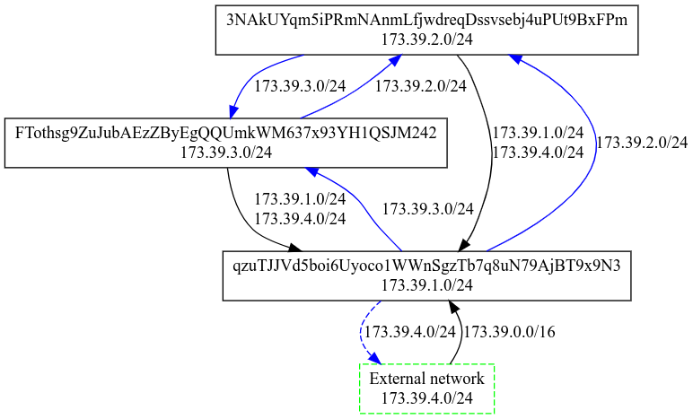
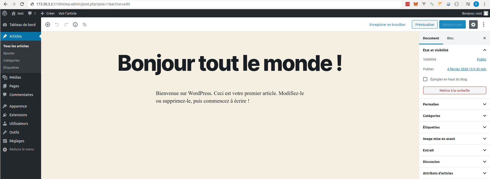
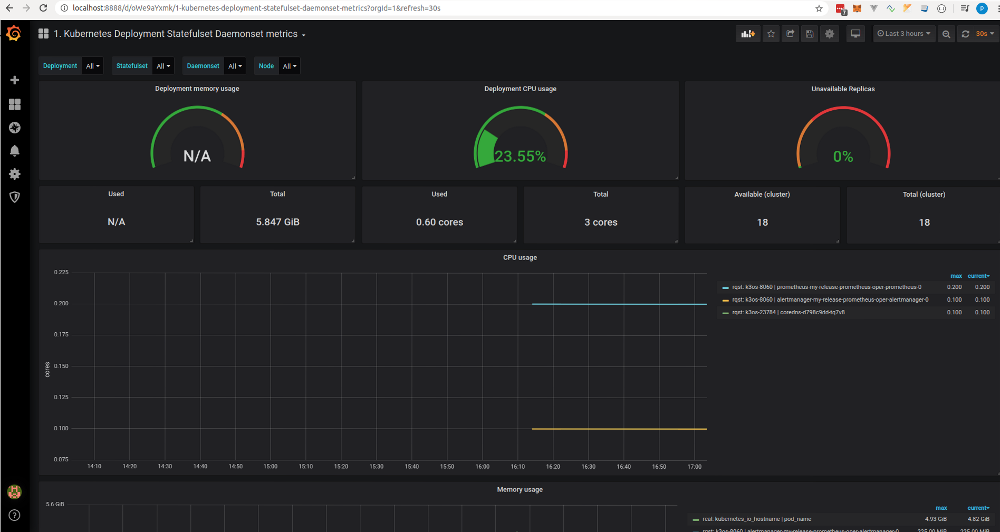
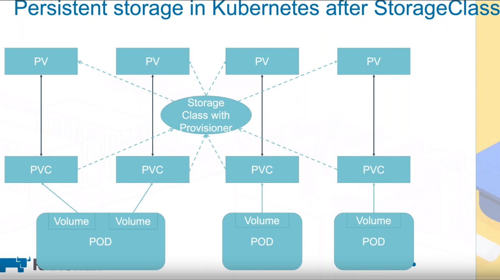
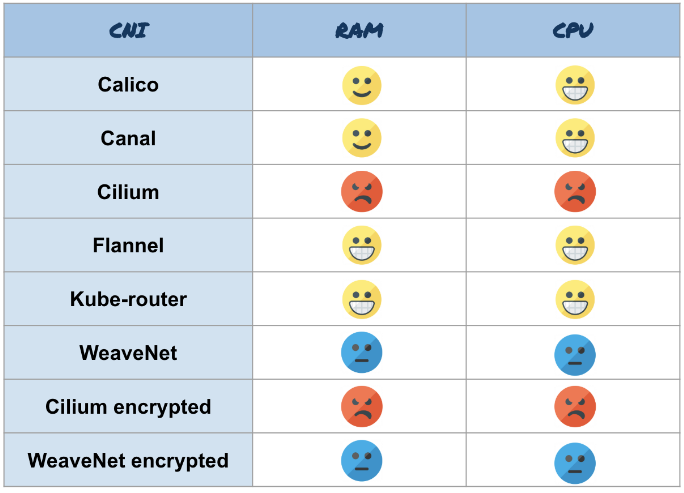
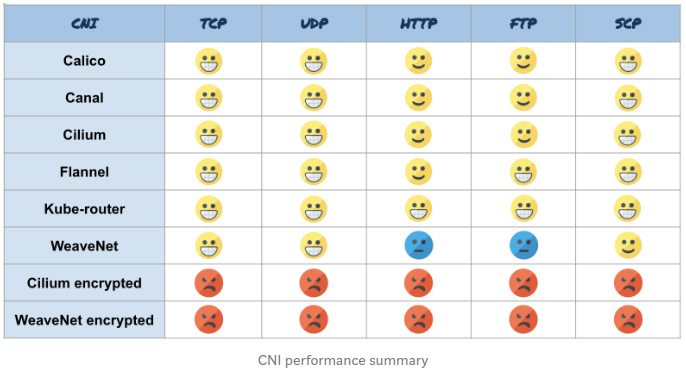
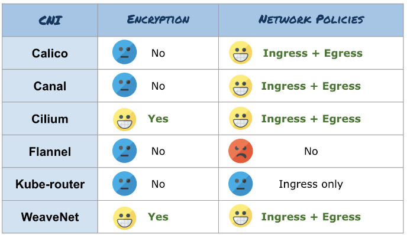

# Kubernetes cluster provisioning, deploiement and examples on Threefold Grid

In this guide we will walk you through the provisioning of a full-blown kubernetes cluster
on the TF grid.

We will then see how to connect to it and interact using kubectl on our local machine.

Finally we will go through some examples use cases to grasp the features offered by the cluster.

# TL;DR

If you quickly want to setup a kubernetes cluster and start to play with it, you can launch the startup script.

Prerequisite:

- linux based OS
- [kubectl](https://kubernetes.io/fr/docs/tasks/tools/install-kubectl/)
- github account with [ssh key linked to your account](https://help.github.com/en/enterprise/2.17/user/github/authenticating-to-github/generating-a-new-ssh-key-and-adding-it-to-the-ssh-agent)

```
$ chmod +x startup.sh
$ ./startup.sh zgorizzo69 "173.40" 1 2
```

This will build tfuser provision a network

# Provisioning and Deploiement of the cluster

Our CLI tool tfuser makes it easy to interact with the TFGrid and provision a kubernetes cluster.

## Tfuser Install

Tfuser is included in our zos repository. Let's clone the repository and build the binary

```
$ git clone https://github.com/threefoldtech/zos
$ cd tools
$ make tfuser
cd tfuser && go build -ldflags '-w -s -X github.com/threefoldtech/zos/pkg/version.Branch=fcvm -X github.com/threefoldtech/zos/pkg/version.Revision=c00740b8fbb75746cd02fb5614ccf57342b7a9f4 -X github.com/threefoldtech/zos/pkg/version.Dirty='
$ cd tfuser
$ ./tfuser --help
```

## Identity on the TF Grid

To interact with the grid we need an indentity which is simply some cryptographic keys that we will use to sign transaction on the network.
Let's generate them with tfuser

```
$ tfuser id
new identity generated: 7HZd49ugHzJxQUnHKyQRbmcwWWvKKtoJUndfiiXGTkow
seed saved at user.seed
```

NB: a file named user.seed has been created. This file is sensitive as it stores your private key. Make sure not to loose that file.

## Provisioning

To provision our VMs we first need to setup a network between different Nodes on the TFGrid
We will use devnet Nodes to select some nodes go to :[devnet Cockpit](https://cockpit.devnet.grid.tf/)
We picked three nodes identified by these NodeId

- nodeid1: FTothsg9ZuJubAEzZByEgQQUmkWM637x93YH1QSJM242
- nodeid2: 3NAkUYqm5iPRmNAnmLfjwdreqDssvsebj4uPUt9BxFPm
- nodeid3: 2anfZwrzskXiUHPLTqH1veJAia8G6rW2eFLy5YFMa1MP

Becarefull NodeId is case sensitive

### Networking

We now need to create a network between the nodes. Hopefully tfuser can help us generate the configuration file.
Let's first create a network named `kubetest` with a large cidr `173.30.0.0/16` and write that configuration inside a file `network.json`

```
$ ./tfuser generate --schema network.json network create --name kubetest --cidr 173.30.0.0/16
```

now let's add the nodes that we have selected inside our network by specifying the path to our `network.json` network configuration file. We also specify a port for wireguard to use and a subnet to use on the nodes.

```
$ ./tfuser generate --schema network.json network add-node --node qzuTJJVd5boi6Uyoco1WWnSgzTb7q8uN79AjBT9x9N3  \
				      --subnet 173.30.1.0/24
$ ./tfuser generate --schema network.json network add-node --node 3NAkUYqm5iPRmNAnmLfjwdreqDssvsebj4uPUt9BxFPm \
				      --subnet 173.30.2.0/24
$ ./tfuser generate --schema network.json network add-node --node FTothsg9ZuJubAEzZByEgQQUmkWM637x93YH1QSJM242 \
				      --subnet 173.30.3.0/24
```

there are two levels here :

- one for the global network with a cidr /16
- one for network resources on the node with a cidr /24. All workloads in this network resource will receive an IP from this subnet. The subnet must be part of the CIDR provided when the network is created.

**NOTE** that you can't give the same subnet to all of your nodes. Each node must be assigned a different /24 subnet that is part of the global /16 of the network.

We will need an external access to the network to be able to ssh into our VMs.

```
$ ./tfuser generate --schema network.json network add-access --node qzuTJJVd5boi6Uyoco1WWnSgzTb7q8uN79AjBT9x9N3 \
				      --subnet 173.30.4.0/24 --ip4 > wg.conf
```

We generated the wireguard, a secure and fast VPN, configuration file that we will use here after in this guide.

Let's take a look at a graphical representation of our network

```
$ ./tfuser generate --schema network.json network graph
```

This will generate network.json.dot file. You can copy paste the content on a website like [graphiz](https://dreampuf.github.io/GraphvizOnline) to see the visual representation of the network we defined.



Now we have a nodes in a network definition ready to be provisioned. Let's use our seed to sign the transaction and ask for a 2 hours provision.

```
$ ./tfuser provision --schema network.json --duration 2 --seed user.seed \
				      --node qzuTJJVd5boi6Uyoco1WWnSgzTb7q8uN79AjBT9x9N3 \
				      --node FTothsg9ZuJubAEzZByEgQQUmkWM637x93YH1QSJM242 \
				      --node 3NAkUYqm5iPRmNAnmLfjwdreqDssvsebj4uPUt9BxFPm
Reservation for 48h0m0s send to node qzuTJJVd5boi6Uyoco1WWnSgzTb7q8uN79AjBT9x9N3
Resource: /reservations/2406-1
Reservation for 48h0m0s send to node FTothsg9ZuJubAEzZByEgQQUmkWM637x93YH1QSJM242
Resource: /reservations/2407-1
Reservation for 48h0m0s send to node 3NAkUYqm5iPRmNAnmLfjwdreqDssvsebj4uPUt9BxFPm
Resource: /reservations/2408-1
```

you can check the status of the provision with the live command

```

$ ./tfuser live --seed user.seed --end 3000
ID:2406-1 Type:   network expired at:31-Jan-2020 16:18:31state:     ok  network ID:
ID:2407-1 Type:   network expired at:31-Jan-2020 16:18:31state:     ok  network ID:
ID:2408-1 Type:   network expired at:31-Jan-2020 16:18:31state:     ok  network ID:

```

We will now use the wg.conf file previously generated to connect to our network with wireguard a secure and fast vpn.
be sure to install wireguard and then simply run this command to create a network interface and join the defined network

```
$ wg-quick up ./wg.conf
```

We have setup and provision a network on the grid that we can join through wireguard.
Let's now provision some Kubernetes VM on those nodes

### Provision

Let's provision a kubernetes VM on our first node and assign an IP allowed in the network `kubetest` defined here above.
Replace `GITHUB_USERNAME` by your github username. We choose an IP for the VM that is part of the subnet we previously defined for the node. We can't choose 173.30.3.1 as it is the IP of the network ressource itself.

```
./tfuser generate --schema kube1.json kubernetes --size 1 --network-id kubetest --ip 173.30.1.2 --secret token --node qzuTJJVd5boi6Uyoco1WWnSgzTb7q8uN79AjBT9x9N3  --ssh-keys "github:GITHUB_USERNAME" &&  \
 ./tfuser -d provision --schema kube1.json --duration 2 --seed user.seed --node qzuTJJVd5boi6Uyoco1WWnSgzTb7q8uN79AjBT9x9N3
```

```
./tfuser generate --schema kube2.json kubernetes --size 1 --network-id kubetest --ip 173.30.2.2 --master-ips 173.30.1.2 --secret token --node 3NAkUYqm5iPRmNAnmLfjwdreqDssvsebj4uPUt9BxFPm  --ssh-keys "github:GITHUB_USERNAME" &&  \
 ./tfuser -d provision --schema kube2.json --duration 2 --seed user.seed --node 3NAkUYqm5iPRmNAnmLfjwdreqDssvsebj4uPUt9BxFPm
```

```
./tfuser generate --schema kube3.json kubernetes --size 1 --network-id kubetest --ip 173.30.3.2 --master-ips 173.30.1.2 --secret token --node FTothsg9ZuJubAEzZByEgQQUmkWM637x93YH1QSJM242  --ssh-keys "github:GITHUB_USERNAME" &&  \
 ./tfuser -d provision --schema kube3.json --duration 2 --seed user.seed --node FTothsg9ZuJubAEzZByEgQQUmkWM637x93YH1QSJM242
```

### Connect to the cluster

At this point you should be able to ping your master node and ssh into it.

Check that wg is up and running.

```
$ sudo wg
interface: wg
  public key: vQyDgg9yHp3OsqosDO/Xyutu7efMaCYGmz5JswJvniQ=
  private key: (hidden)
  listening port: 41951

peer: BQE9qUNPKEH59Fy6B2xyMz0KrRfBDIdDm4Bd23ro8DM=
  endpoint: 185.69.166.246:3561
  allowed ips: 173.30.5.0/24, 100.64.30.5/32
  latest handshake: 2 minutes, 43 seconds ago
  transfer: 14.26 KiB received, 19.14 KiB sent
  persistent keepalive: every 20 seconds

```

log into your VM

```
$ ping 173.30.1.2
$ ssh rancher@173.30.1.2
The authenticity of host '173.30.1.2 (173.30.1.2)' can't be established.
ECDSA key fingerprint is SHA256:Q4kQ94B8QaSbo1EsyI8dQrgBkZyk/USda72c8nwVwIE.
Are you sure you want to continue connecting (yes/no)? yes
Warning: Permanently added '173.30.1.2' (ECDSA) to the list of known hosts.
Welcome to k3OS!

Refer to https://github.com/rancher/k3os for README and issues

By default mode of k3OS is to run a single node cluster. Use "kubectl"
to access it.  The node token in /var/lib/rancher/k3s/server/node-token
can be used to join agents to this server.

k3os-15956 [~]$
```

Let's get all nodes of the cluster

```
k3os-15956 [~]$ k3s kubectl get nodes
NAME         STATUS   ROLES    AGE     VERSION
k3os-15956   Ready    master   3m46s   v1.16.3-k3s.2
k3os-15957   Ready    <none>   2m26s   v1.16.3-k3s.2
k3os-15958   Ready    <none>   1m42s   v1.16.3-k3s.2
```

Copy the config so that we can use kubectl from our local machine. By default it is located in `/etc/rancher/k3s/k3s.yaml` on the master node.

Execute this command on your local machine not in a remote shell

```
$ scp rancher@173.30.1.2:/etc/rancher/k3s/k3s.yaml ./k3s.yaml
```

If you already have a kube config file usually located in `~/.kube/config`
you can edit it and add the new cluster with the informations written on k3s.yaml

here is an example of `~/.kube/config`

```
apiVersion: v1
clusters:
- cluster:
    certificate-authority-data: LS0tLS1CRUdLKjhdDGhjDHKHKhDBJWakNCL3FBREFnRUNBZ0VBTUFvR0NDcUdTTTQ5QkFNQ01DTXhJVEFmQmdOVkJBTU1HR3N6Y3kxelpYSjIKWlhJdFkyRkFNVFU0TURjME9EQXhOakFlRncweU1EQXlNRE14TmpRd01UWmFGdzB6TURBeE16RXhOalF3TVRaYQpNQ014SVRBZkJnTlZCQU1NR0dzemN5MXpaWEoyWlhJdFkyRkFNVFU0TURjME9EQXhOakPPOIHjkDHDJHGkFnRUddaW9tdVR1MXQ1aVRlZDhHaVFrQ2FrdnRWL2xpRGJ3MUlxSS94dEkKWmUya2Y3Tm1mL0txR3IrMzN5SVZ5Q0tkaEdlelBCbEsvanNUSkZVSWpzdWpJekFoTUE0R0ExVWREd0DezdzedzenTlZIUk1CQWY4RUJUQURBUUgvTUFvR0NDcUdTTTQ5QkFNQ0EwY0FNRVFDSUJFNTYzcUttY2xiClVQWHc2UXJCbWxQUmlrbWdCVnY0VHlkMVZ0TWNXY3JYQWlCVlJPY3RjMTF1TXFrOGJWVHJOVFNiN0lFS3ZkRjAKelluMzhwME41MdLUVORCBDRVJUSUZJQ0FURS0D=
    server: https://170.30.1.2:6443
  name: k3s
- context:
    cluster: k3s
    namespace: default
    user: k3s
  name: k3s
current-context: k3s
kind: Config
preferences: {}
users:
- name: k3s
  user:
    password: 8719c8d71457366ecaff927cf784
    username: admin
```

or leverage the KUBECONFIG environment variable

```
$ export KUBECONFIG=/home/zgo/k3s.yaml
$ kubectl get pods --all-namespaces
$ helm ls --all-namespaces
```

Or specify the location of the kubeconfig file per command:

```
kubectl --kubeconfig ./k3s.yaml get pods --all-namespaces
helm --kubeconfig ./k3s.yaml ls --all-namespaces
```

### Delete a Provision

You can delete a provision based on its ID which is returned by `tfuser live`

```
$ ./tfuser live --seed user.seed --end 3000
ID:2587-1 Type:   network expired at:05-Feb-2020 18:02:23state:     ok  network ID:
```

```
$ ./tfuser delete --id 2587-1
Reservation 2587-1 marked as to be deleted
```

## Workload deploiement

### Wordpress example

We will launch a wordpress deploiement connected to a mysql database.
Let's first create the mysql deploiement including a service, a sceret for the DB password and a persistant volume. By default with k3s persistant volume storage class is [local-path](https://rancher.com/docs/k3s/latest/en/storage/)

```
$ cd ressources/wordpress
$ kubectl create -f 1-mysql-pvc.yaml
persistentvolumeclaim/mysql-persistent-storage created
$ kubectl create -f 2-mysql-secret.yaml
secret/mysql-pass created
$ kubectl create -f 3-mysql-deploy.yaml
deployment.apps/mysql created
$ kubectl create -f 4-mysql-svc.yaml
service/mysql created
```

let's do the same for the wordpress deploiement

```
$ kubectl create -f 5-wordpress-pvc.yaml
persistentvolumeclaim/wordpress-persistent-storage created
$ kubectl create -f 6-word-deploy.yaml
deployment.apps/wordpress created
$ kubectl create -f 7-wordpress-svc.yaml
service/wordpress created
$ kubectl get po
NAME                         READY   STATUS              RESTARTS   AGE
mysql-5ddb94d667-whpnx       1/1     Running             0          5m48s
wordpress-76f568758d-qdjgn   1/1     Running             0          8s
wordpress-76f568758d-2qhm2   1/1     Running             0          8s
```

Let's connect to the administrator interface through the wordpress NodePort service that we have just created. Let's first retrieve the port open for that service on the nodes

```
$ kubectl get -o jsonpath="{.spec.ports[0].nodePort}" services wordpress
31004
```

We can browse any nodes url on port 31004 to find the wordpress website e.g. [http://173.30.3.2:31004/](http://173.30.3.2:31004/)
and after some setup screens you will access your articles



### Helm charting

K3s comes with helm support built-in. Let's try to deploy prometheus and grafana monitoring of the cluster through HELM charts.

```
$ kubectl create namespace mon
$ helm install --namespace mon --skip-crds  my-release stable/prometheus-operator
$ helm list
NAME            NAMESPACE       REVISION        UPDATED                                 STATUS          CHART                      APP VERSION
my-release      mon             1               2020-02-04 16:08:41.70990744 +0100 CET  deployed        prometheus-operator-8.5.11 0.34.0
$ kubectl config set-context --current --namespace=mon
$ kubectl get po
NAME                                                     READY   STATUS    RESTARTS   AGE
my-release-kube-state-metrics-778b4d9786-tqp9r           1/1     Running   0          7m34s
my-release-prometheus-node-exporter-xfdgv                1/1     Running   0          7m35s
my-release-prometheus-node-exporter-ngzb4                1/1     Running   0          7m35s
my-release-prometheus-node-exporter-lvmp8                1/1     Running   0          7m35s
my-release-prometheus-oper-operator-69cc584dfb-lxjwp     2/2     Running   0          7m34s
alertmanager-my-release-prometheus-oper-alertmanager-0   2/2     Running   0          7m21s
my-release-grafana-6c447fc4c8-zkc4x                      2/2     Running   0          7m34s
prometheus-my-release-prometheus-oper-prometheus-0       3/3     Running   1          7m10s
```

Let's connect to the grafana interface through the deployment that we have just created.

We setup port forwarding to listen on port 8888 locally, forwarding to port 3000 in the pod selected by the deployment my-release-grafana

```
$ kubectl port-forward deployment/my-release-grafana  8888:3000
Forwarding from 127.0.0.1:8888 -> 3000
Forwarding from [::1]:8888 -> 3000
```

We can browse localhost on port 8888 to find the grafana UI e.g. [http://localhost:8888/](http://localhost:8888/)
The username is `admin` and the default admin password to log into the grafana UI is `prom-operator`
Then you can for instance import a dashboard and use the ID 8588 and don't forget to select the prometheus data source

or the dashboard ID 6879


## Storage

### Local Path k3s storage class

When deploying an application that needs to retain data, you’ll need to create persistent storage. Persistent storage allows you to store application data external from the pod running your application. This storage practice allows you to maintain application data, even if the application’s pod fails.

A persistent volume (PV) is a piece of storage in the Kubernetes cluster, while a persistent volume claim (PVC) is a request for storage.



PV has three access modes

- RWO: Read Write Once. It can only be read/write on one node at any given time
- RWX: Read Write Many. It can only be read/write on multiple node at the same time
- ROX: Read Only Many

K3s comes with Rancher’s Local Path Provisioner and this enables the ability to create persistent volume claims out of the box using local storage on the respective node.
StorageClass "local-path": Only support ReadWriteOnce access mode

let's create a hostPath backed persistent volume claim and a pod to utilize it:

```
$ cd ressources/storage/simple-localpath/
$ kubectl create -f pvc.yaml
$ kubectl create -f pod.yaml
$ kubectl get pods -n default
NAME                         READY   STATUS    RESTARTS   AGE
volume-test                  1/1     Running   0          2m

```

### Rook

Rook is an open source cloud-native storage orchestrator, providing the platform, framework, and support for a diverse set of storage solutions to natively integrate with cloud-native environments.

Rook turns storage software into self-managing, self-scaling, and self-healing storage services. It does this by automating deployment, bootstrapping, configuration, provisioning, scaling, upgrading, migration, disaster recovery, monitoring, and resource management. Rook uses the facilities provided by the underlying cloud-native container management, scheduling and orchestration platform to perform its duties.

installing [rook](https://rook.io/docs/rook/v1.2/)

```
git clone --single-branch --branch release-1.2 https://github.com/rook/rook.git
cd cluster/examples/kubernetes/ceph
kubectl create -f common.yaml
kubectl create -f operator.yaml
kubectl create -f cluster-test.yaml
```

### Installing [rook NFS](https://rook.io/docs/rook/v1.2/nfs.html)

NFS allows remote hosts to mount filesystems over a network and interact with those filesystems as though they are mounted locally. This enables system administrators to consolidate resources onto centralized servers on the network.

#### First deploy the Rook NFS operator using the following commands:

```
$ cd resources/storage/rook-NFS
$ kubectl create -f 1-operator.yaml
```

We will create a NFS server instance that exports storage that is backed by the default StorageClass. In k3s environments storageClass "local-path": Only support ReadWriteOnce access mode so for the PVC taht must be created before creating NFS CRD instance.

```
$ kubectl create -f 2-nfs.yaml
$ kubectl get pvc -n rook-nfs
NAME                STATUS   VOLUME                                     CAPACITY   ACCESS MODES   STORAGECLASS   AGE
nfs-default-claim   Bound    pvc-9804c4f1-80e1-45ec-bf05-3dbdd012564e   1Gi        RWO            local-path     3m49s
$ kubectl get po -n rook-nfs
NAME         READY   STATUS    RESTARTS   AGE
rook-nfs-0   1/1     Running   0          16s
```

#### Accessing the Export through dynamic NFS provisioning

Once the NFS Operator and an instance of NFSServer is deployed. A storageclass has to be created to dynamically provisioning volumes.
The StorageClass need to have the following 3 parameters passed.

- exportName: It tells the provisioner which export to use for provisioning the volumes.
- nfsServerName: It is the name of the NFSServer instance.
- nfsServerNamespace: It namespace where the NFSServer instance is running.

```
$ kubectl create -f 3-sc.yaml
```

Once the above storageclass has been created create a PV claim referencing the storageclass as shown in the example given below.

```
$ kubectl create -f 4-pvc.yaml
```

#### Consuming the Export

Now we can consume the PV that we just created by creating an example web server app that uses the above `PersistentVolumeClaim` to claim the exported volume. There are 2 pods that comprise this example:

- A web server pod that will read and display the contents of the NFS share
- A writer pod that will write random data to the NFS share so the website will continually update
  Start both the busybox pod (writer) and the web server from the ressources/storage/rook-NFS folder:

```
kubectl create -f busybox-rc.yaml
kubectl create -f web-rc.yaml
```

CANT CREATE POD SUCK IN CONTAINER CREATING

```
  Warning  FailedMount       15m                   kubelet, zv2k8s-04  Unable to attach or mount volumes: unmounted volumes=[rook-nfs-vol], unattached volumes=[default-token-f6sx2 rook-nfs-vol]: timed out waiting for the condition
  Warning  FailedMount       2m31s (x10 over 16m)  kubelet, zv2k8s-04  MountVolume.SetUp failed for volume "pvc-903d405d-0c9c-4af7-bc2d-356fc03905fb" : mount failed: exit status 255
Mounting command: mount
Mounting arguments: -t nfs 10.43.102.171:/nfs-default-claim /var/lib/kubelet/pods/91d477ac-7e3f-4957-b427-0a3f2a68847b/volumes/kubernetes.io~nfs/pvc-903d405d-0c9c-4af7-bc2d-356fc03905fb
```

probably need nfs-common

### Installing [rook CEPH](https://rook.io/docs/rook/v1.2/ceph.html)

RBD

Rook Ceph requires a Linux kernel built with the RBD module. Many distributions of Linux have this module but some don’t, e.g. the GKE Container-Optimised OS (COS) does not have RBD. You can test your Kubernetes nodes by running modprobe rbd. If it says ‘not found’, you may have to rebuild your kernel or choose a different Linux distribution.

CephFS

If you will be creating volumes from a Ceph shared file system (CephFS), the recommended minimum kernel version is 4.17. If you have a kernel version less than 4.17, the requested PVC sizes will not be enforced. Storage quotas will only be enforced on newer kernels.

No RDB module and kernel < 4.17

```
usr/lib/modules/4.14.82-Zero-OS/kernel/drivers # find /usr/lib/modules | grep rdb
/usr/lib/modules/4.14.82-Zero-OS/kernel/drivers/media/rc/keymaps/rc-avermedia-cardbus.ko
```

## Load balancing and external IP

#### Klipper

K3s comes with [klipper](https://github.com/rancher/klipper-lb). It assigns the IP of the node to the loadBalancer service. This works by using a host port for each service load balancer and setting up iptables to forward the request to the cluster IP.

This means that klipper can't provision other IP for that we need metalLB

#### Metal LB

The idea is to have a fix IP to connect to that can handle load balancing between the pods. We use metallb to provision IP on demand for LoadBalancer services.
We can apply the first two files in the metallb folder

```
$ cd ressources/metallb
$ kubectl create -f 1-metallb.yaml
$ kubectl create -f 2-config_and_registration_service.yaml
```

this will install metallb on our cluster and configure it via a configmap
and lastly it will create a service of type loadbalancer with a fix IP `173.30.1.168`
Take a look at the configmap if you want to modify the IP range available to metalLB.

## Public IP

### Accessing the cluster from a public domain

we need to initiate a connection from the cluster to an external machine with a public IP. We direct the tunnel to the traefik (or any other ingress controller) service IP

```
$ kubectl get svc -n kube-system
NAME             TYPE           CLUSTER-IP      EXTERNAL-IP   PORT(S)                                     AGE
kube-dns         ClusterIP      10.43.0.10      <none>        53/UDP,53/TCP,9153/TCP                      6d5h
metrics-server   ClusterIP      10.43.36.33     <none>        443/TCP                                     6d5h
traefik          LoadBalancer   10.43.178.254   172.31.1.50   80:32015/TCP,443:32432/TCP,8080:30137/TCP   6d5h
```

We tried with [inlets](https://github.com/inlets/inlets).

Follow the guide and you will end up executing this kind of command on your master node.

```
inlets client  --remote "mydomain.be:8080"  --upstream "http://172.30.1.50:80"  --token "${AUTHTOKEN}"
```

If you have deployed the drupal-mysql example which contains an ingress ressources you can modify the ingress to the domain name here it is mydomain.be so that now when you hit http://mydomain.be you are redirected to the drupal website

## CNI

Container networking is the mechanism through which containers can optionally connect to other containers, the host, and outside networks like the internet.
The idea behind the CNI initiative is to create a framework for dynamically configuring the appropriate network configuration and resources when containers are provisioned or destroyed.

### Benchmark

**Ressources consumption**



**Performance**



**Network Policies and Encryption**



### Flannel by default

It is one of the most mature examples of networking fabric for container orchestration systems, intended to allow for better inter-container and inter-host networking.

From an administrative perspective, it offers a simple networking model that sets up an environment that’s suitable for most use cases when you only need the basics.

By default, K3s will run with flannel as the CNI.
The default backend for flannel is VXLAN. We can enable encryption by passing the IPSec (Internet Protocol Security) or WireGuard options .

### Calico

Project Calico, or just Calico, is another popular networking option in the Kubernetes ecosystem. While Flannel is positioned as the simple choice, Calico is best known for its performance, flexibility, and power. Calico takes a more holistic view of networking, concerning itself not only with providing network connectivity between hosts and pods, but also with network security and administration. The Calico CNI plugin wraps Calico functionality within the CNI framework.

calico kernel requirement

- nf_conntrack_netlink subsystem
- ip_tables (for IPv4)
- ip6_tables (for IPv6)
- ip_set
- xt_set
- ipt_set
- ipt_rpfilter
- ipt_REJECT
- ipip (if using Calico networking)

Unlike Flannel, Calico does not use an overlay network. Instead, Calico configures a layer 3 network that uses the BGP routing protocol to route packets between hosts. This means that packets do not need to be wrapped in an extra layer of encapsulation when moving between hosts. The BGP routing mechanism can direct packets natively without an extra step of wrapping traffic in an additional layer of traffic.

In addition to networking connectivity, Calico is well-known for its advanced network features. Network policy is one of its most sought after capabilities. In addition, Calico can also integrate with Istio, a service mesh, to interpret and enforce policy for workloads within the cluster both at the service mesh layer and the network infrastructure layer. This means that you can configure powerful rules describing how pods should be able to send and accept traffic, improving security and control over your networking environment.

Run K3s with --flannel-backend=none
./k3s server --flannel-backend=none &

## HA :warning: (WIP) :construction_worker:


