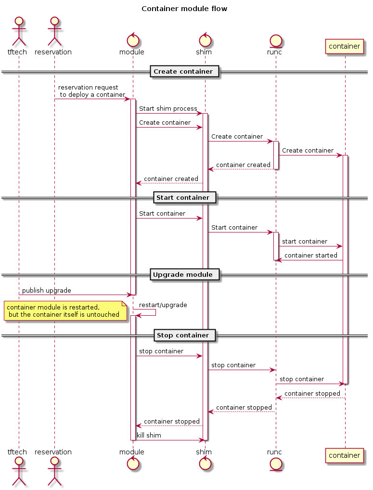

# Container module

This module is responsible to manage containerized applications.
Its only focus is about starting a process with the proper isolation. So there is no notion of storage or networking in this module, this is handled by the layer above.

The container runtime used will be compatible with the [OCI specification](https://github.com/opencontainers/runtime-spec), but which one in particular is still to be decided.

## Design

One of the requirements of the container module is that any container running on 0-OS should not be affected by an upgrade/restart of any 0-OS module.
In order to do that, we need to have shim process that keeps the file descriptor of the container open in case of a restart of the container module. The shim process is going to be the one responsible to talk to the OCI runtime to manage the container itself.

Next is a simplify version of the lifetime flow a container:



## Implementation

Most of the work to implement such a system as already been done by other. Mainly containerd has some very nice libraries around
shim and runc.

Here is a list of link of interest:
- [containerd](https://github.com/containerd/containerd)
  - specifically the runtime package: https://github.com/containerd/containerd/tree/master/runtime
- [containerd client example](https://github.com/containerd/containerd/blob/master/docs/getting-started.md)
- [list of project that have integrated containerd](https://github.com/containerd/containerd/blob/master/ADOPTERS.md)
- [firecracker shim design](https://github.com/firecracker-microvm/firecracker-containerd/blob/master/docs/shim-design.md)


## Module interface

```go
type ContainerID string

type NetworkInfo struct{
    // Currently a container can only join one (and only one)
    // network namespace that has to be pre defined on the node
    // for the container tenant
    
    // Containers don't need to know about anything about bridges,
    // IPs, wireguards since this is all is only known by the network
    // resource which is out of the scope of this module
    Namespace string
}

type MountInfo struct {
    Source string // source of the mount point on the host
    Target string // target of mount inside the container
}

type ContainerInfo struct {
    ID ContainerID
    //Container info
    Name string
    Flist string 
    Tags []string
    Network NetworkInfo
    Mounts []MountInfo

    // NOTE:
    // Port forwards are not defined by the container. It can be defined
    // by the Network namespace resource. BUT ideally, no port forwards 
    // will ever be needed since all is gonna be routing based.
}


type ContainerModule interface {
    // Run creates and starts a container on the node. It auto starts commnad line
    // defined by `entrypoint`
    Run(name string, flist string, tags []string, network NetworkInfo, 
            mounts []MountInfo, entrypoint string) (ContainerID, error)

    // Inspect, return information about the container, given its container id
    Inspect(id ContainerID) (ContainerInfo, error)
    Delete(id ContainerID) error
}
```