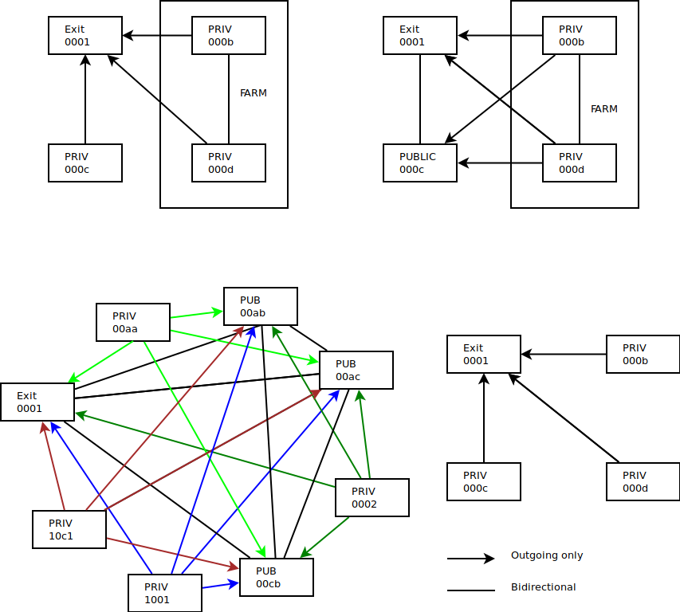

```
for netresources of network
  if netresource.node.conntype == hidden --and-- netresource NOT in same farm
     wgpeer = exitnode
     allowedips.append(netresource.prefix)
     routes.append(netresource.prefix via exitnode.fe80:netresource.prefix.nibble)
  else if netresource == public --or-- netresource in same farm
     wgpeer = netresource.peer
     allowedips = netresource.prefix
     route = netresource.prefix via netresource.fe80:netresource.prefix.nibble
  fi
endfor
```


That way
  - all hidden nodes establish connections to public peers
  - all hidden nodes do not connect to hidden nodes, but only to the exit node.
  for that, they add the prefixes for that netresource that is hidden and the route to
  the exit node
  - public nodes behave the same, where all hidden nodes have allowedips
  and routes via the exit node
  - the public nodes do not need to add a peer destination address for hidden nodes,
  as they will be contacted by the hidden nodes for 2 reasons
    - the setup of fe80::xxxx does a neighbor discovery so a packet gets sent
    - PersistentKeepalive starts the connection regardless of packets ?



